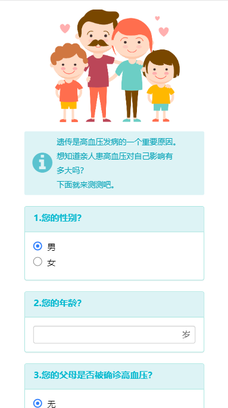
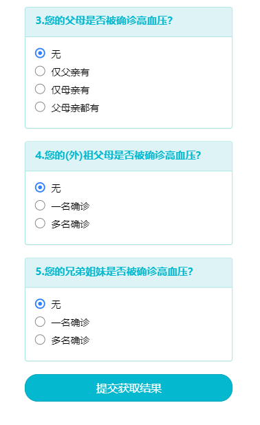
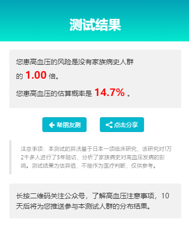
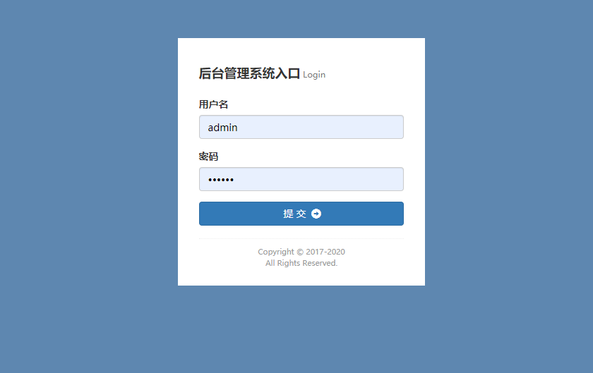
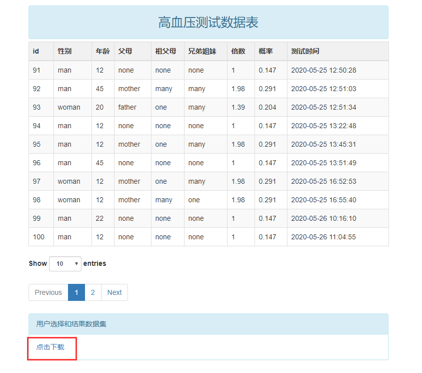

# 项目说明

## 说明

此项目为微信h5页面的测试问卷，通过选择后得出患高血压的概率,可通过后台页面导出数据到excel。

## 截图







## 后台一键导出excel数据

访问地址：localhost:8081/back，用户名：admin，密码：123qwe






# 如何开始

> 1.创建hypertension数据库
> 2.导入resources下的hypertension.sql的表结构和数据
> 3.修改application.properties下的数据库信息为自己的数据库信息
>
> 4.前台访问:localhost:8081/tets
>
> 5.后台访问:localhost:8081/back

# 技术框架

```
后端：
java,springboot,mybatis
前端：
jq,zui
```

